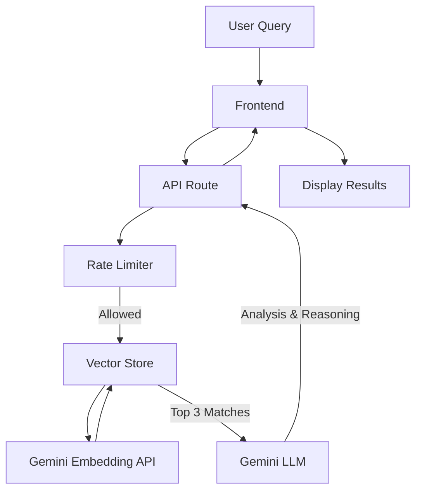

# Smart Travel Scout - AI Experience Discovery

A clean, minimalist web application that uses Gemini 1.5 Flash (via `gemini-3-flash-preview`) to help users find travel experiences from a curated inventory. Designed for visual excellence and premium user experience.

## Features
- **AI-Powered Search**: Semantic search mapping user intent to specific inventory items.
- **Strict Grounding**: Zero hallucinations. Suggestions are strictly retrieved from the provided dataset using vector search.
- **Reasoning UX**: Transparent explanations for why each destination matches the search criteria.
- **Minimalist Design**: A premium, "light-mode" aesthetic with a custom navbar, footer, and smooth Framer Motion animations.
- **Rate Limiting**: Built-in in-memory rate limiting (5 requests per 60s) to ensure stability and quota management.

## Technical Stack
- **Framework**: Next.js 16 (App Router)
- **AI Models**: 
  - `gemini-3-flash-preview` (LLM & Reasoning)
  - `gemini-embedding-001` (Vector Embeddings)
- **Styling**: Tailwind CSS 4
- **State & Validation**: Zod (Schema-level grounding)
- **Animations**: Framer Motion

## Passion Check - Technical Assessment Answers

### 1. The "Under the Hood" Moment
A specific technical hurdle was ensuring the AI consistently returned a structured JSON format that mapped exactly to my TypeScript interfaces. I initially faced "hallucinated" fields in the reasoning section. I debugged this by implementing **Zod schema validation** at the API boundary, enforcing a strict schema in the system prompt, and using Gemini's structured output mode (`responseMimeType: "application/json"`). This ensures that if the AI response doesn't perfectly match our required structure, the system catches the error before it reaches the UI.

### 2. The Scalability Thought
If the inventory grew to 50,000 items, passing the entire JSON array in the system prompt would exceed token limits and become prohibitively expensive. My approach would shift to a **RAG (Retrieval-Augmented Generation)** architecture:
1. **Vector Embeddings**: Pre-compute embeddings for all items using `gemini-embedding-001`.
2. **Top-K Retrieval**: When a user searches, perform a semantic search (cosine similarity) against a vector database to retrieve the top 10-20 most relevant items.
3. **Context Injection**: Only pass these relevant items to the LLM for final reasoning and ranking. This maintains high precision while keeping token costs low and performance high.

### 3. The AI Reflection
I used Antigravity (built on Gemini) to help build this project. During the Gemini API integration, I noticed that some of the implementation patterns suggested by Antigravity did not fully align with the latest official documentation. Certain configurations and request structures were either outdated or inaccurately generated. I manually reviewed the official documentation, corrected the integration logic, and refactored the API calls to ensure proper structured output handling and stable behavior.

Additionally, I refined the initial system prompt by introducing a clear rubric for matching price tolerances. This significantly improved the consistency and accuracy of the AI-generated recommendations.

## Setup & Deployment

1. **Clone the repository**
2. **Set up Environment Variables**:
   Create a `.env.local` file:
   ```env
   GOOGLE_GENERATIVE_AI_API_KEY=your_gemini_api_key_here
   ```
3. **Install Dependencies**: `npm install`
4. **Run Locally**: `npm run dev`
5. **Deploy**: Push to GitHub and connect to Vercel.

## Architecture



---
Developed by **Manuth Kausilu**